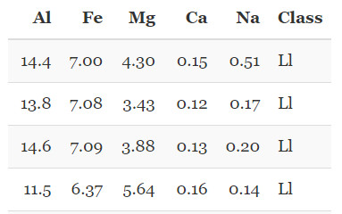

<style type="text/css">
body, td {font-size: 15px;}
code.r{font-size: 5px;}
pre { font-size: 12px;}
</style>


```{r setup, include=FALSE}
knitr::opts_chunk$set(echo = TRUE)
```


<FONT color='#0066CC'><FONT size = 4 >

::: {align="center"}
Fouille de données avec R pour la data science et l'intelligence artificielle\

III.TD 3 : Partie I - MANOVA
:::

</FONT></FONT>


<FONT color='#0066CC'><FONT size = 4 >

::: {align="center"}
Badr TAJINI -- ESIEE Paris\
Source : Bertrand Roudier -- ESIEE Paris
:::

</FONT></FONT>

<hr style="border: 1px  solid gray">

</hr>

<DIV align = justify>

### <FONT color='#0066CC'><FONT size = 4> 1. Introduction </FONT></FONT>

Ce TD a pour objectif de réaliser une analyse de variance multivariée (MANOVA) en développant une fonction dédiée. Nous utilisons dans un premier temps un jeu de données simple (exemple vu en cours) ou tous les résultats intermédiaires vous sont fournis. 

Une fois votre code intégré dans une fonction, vous vérifiez vos résultats en comparaison avec les résultats fournis par la fonction *manova* de R sur un jeu de données de volumétrie plus importante.

Une partie du code que vous allez développer  nous servira pour la suite lorsque nous aborderons l'analyse factorielle discriminante ; principalement le calcul des inerties inter classes, intra classes et totales


<br>

<hr style="border: 1px  solid gray">


### <FONT color='#0066CC'><FONT size = 4> 2 Rappels </FONT></FONT>

La somme des carrés des écarts total (SCT = Inertie Totale) est la résultante (comme en ANOVA) de la sommes des carrés intra classes (SCresiduelle = SC Intra ) et de la somme des carrés inter classes (SC Ecart = SC Inter)
\[\sum\limits_{i = 1}^n {{d^2}({x_i},g)}  = \sum\limits_{j = 1}^k {{n_j}{d^2}} ({g_j},g) + \sum\limits_{j = 1}^k {\sum\limits_{i = 1}^{{n_k}} {{d^2}({x_{i,j}},{g_j})} } \]

Si nous considérons le jeu de données comme étant la population, nous pouvons directement estimer les variances inter classes et intra classes :
\[\frac{1}{n}\sum\limits_{i = 1}^n {{d^2}({x_i},g)}  = \frac{1}{n}\sum\limits_{j = 1}^k {{n_j}{d^2}} ({g_j},g) + \frac{1}{n}\sum\limits_{j = 1}^k {\sum\limits_{i = 1}^{{n_k}} {{d^2}({x_{i,j}},{g_j})} } \]
Pour réaliser le test de comparaison des groupes, nous calculons

1. la somme des carrés Totaux:  *SST*
2. La somme des carrés Intra:   *SS intra*
3. La somme des carrés Inter par différence : *SS inter = SS Tot - SS intra*
4. la ratio des déterminants: *Det(SS intra) / Det(SS total)*
5. La valeur critique qui suit une distribution de *Chi-Deux* et qui nous permet de réaliser le test

<br>

<hr style="border: 1px  solid gray">

### <FONT color='#0066CC'><FONT size = 4> 3 Pré-requis </FONT></FONT>

Avant de calculer les inerties (SS), et pour rendre le code le plus générique possible, nous devons créer :

  * Une variable *N*  qui correspond aux nombre totale d'individus
  * Une variable *P* qui correspond aux nombres de variables 
  * Un data frame des variables prédictives *X*
  * Un vecteur *Y* de la variable catégorielle
  * Une variable *K* qui correspond aux nombres de groupes (catégories)  
  * Une liste *XK* dont chaque élément contient les individus de chaque groupes
  * Un vecteur *NK*  qui correspond aux nombres d'individus par groupe
  * Une liste *GK* dont chaque élément contient la moyenne des variables de chaque groupe (catégorie)
  * Un vecteur *G* dont chaque élément est la moyenne générale (hors groupe) de chaque variable
  

Nous utilisons le fichier : *MANOVA_DATASET.csv*.  Ce jeu de données comprend 
  
  * 26 observations   
  * 5 variables explicatives numériques 
  * 1 variable factorielle comprenant 4 niveaux (catégories)
  > Note : le fichier **MANOVA_DATASET.csv** doit être transformé en fichier **MANOVA_DATASET.Rda** pour être utilisé dans votre TD correctement.
  
rmq:  Il s'agit ici d'étudier l'existence d'une différence entre la composition chimique de différentes des poteries antiques  retrouvées dans des fouilles archéologiques.


*  **Installation des packages nécessaires :**  
```{r}
# à compléter - indice : appel d'une librairie
install.packages("kableExtra")
```

*  **Chargement des packages nécessaires :**

```{r}
# à compléter - indice : appel d'une librairie
library("kableExtra")
```
*  **Première étape :**
```{r}
# à compléter - indice : data engineering
rm(list=ls()) 
```

*  **Seconde étape :**

```{r}
# à compléter - indice : data engineering
setwd("C:/Users/mathi/Documents/ESIEE Paris/E4/Fouille de donnée/TD2")
data <- read.csv("MANOVA_DATASET.csv")
```

*  **Troisième étape :**

Les données sont les suivantes :

```{r,echo = T,  warning = F}
# à compléter - indice : data engineering
data <- na.omit(data)
head(data)
```
*  **Quatrième étape :**

```{r,   warning = F}
# à compléter - indice : data engineering
data$Class <- as.factor(substr(data$Site, 1, 2))
data$Site <- NULL
head(data)
```

*  **Cinquième étape :**

```{r,   warning = F}
# à compléter - indice : data engineering
save(data, file = 'MANOVA_DATASET.Rda')
```

*  **Sixième étape :**

```{r,echo = T,  warning = F}
# à compléter - indice : data engineering
head(data)
str(data)
summary(data)
```

*  **Septième étape :**

```{r,   warning = F}
data %>%
  kbl(digits = 3) %>%    
  kable_styling(bootstrap_options = "striped", full_width = FALSE, position = "center", latex_options = 'basic') %>% 
  scroll_box(height = "250px", width = '100%')
```


Résultat attendu du nouveau dataset après la création de notre pipeline ELT (Extract-Load-Transform) : 

```{r, echo=FALSE, fig.width = 4, fig.height = 4, fig.align = 'center'}

```
<br>

*  **Nombre total d'individus *N***


```{r N}
# à compléter
N <-nrow(data)
cat("Nombre total d'individus N : ",N)
```


<br>

  * **Nombre de variables prédictives *P* **

Le calcul du nombre de variables prédictives doit être réalisé de manière automatique. Pour y parvenir, on peut, par exemple, identifier les colonnes des variables numériques et calculer la longueur du vecteur des identifiants (utilisation des fonctions *which* et *sapply*)


```{r P}
# à compléter
num_cols <- sapply(data, is.numeric)
P <- length(which(num_cols))
cat("Nombre de variables prédictives P : ",P)
```

<br>


* **Le dataframe *X* des variables prédictives**

```{r X}
# à compléter
X <- data[, sapply(data, is.numeric)]
head(X)
```

<br>

* **Variable catégorielle sous forme d'un vecteur *Y* ** 

```{r Y}
# à compléter
Y <- data$Class
head(Y)
```

<br>


* **Variable *K* qui correspond aux nombres de groupes (catégories)**  

```{r K}
# à compléter
K <- nlevels(data$Class)
K
```

<br>


* **Liste *XK* dont chaque élément contient les individus de chaque groupes **

Pour y parvenir, nous pouvons utiliser la fonction *split*. 
Les éléments sont les suivants :


```{r Xk_1 }
# à compléter
XK <- split(X, Y)
XK
```

<br>


<br>


  * **Vecteur *NK*  qui correspond aux nombres d'individus par groupe**

```{r, NK}
# à compléter
NK <- sapply(XK, nrow)
NK
```

 * **Liste *GK* dont chaque élément contient la moyenne des variables de chaque groupe (catégorie)**

```{r GK}
# à compléter
GK <- sapply(X, colMeans)
GK
```

<br>

 * **Vecteur *G* dont chaque élément est la moyenne générale (hors groupe) de chaque variable**
 
```{r G}
# à compléter
G <- colMeans(X)
G
```
<br> 

<hr style="border: 1px  solid gray">

### <FONT color='#0066CC'><FONT size = 4> 4. Calcul des Inerties </FONT></FONT>

#### <FONT color='#0066CC'><FONT size = 4> 4.1 Inertie totale </FONT></FONT>

La Somme des carrés totaux (Inertie Totale) correspond à la sommes des carrés des distances entre l'ensemble des observations et la moyenne générale :

\[{I_{total}} = \sum\limits_{i = 1}^n {{d^2}({x_i},g)} \] 

Nous pouvons la calculer directement à l'aide du calcul matriciel suivant : 
\[{I_{Tot}} = SST = {(X - G)^t} \times (X - G)\]

Pour y parvenir nous devons :

1. Transformer le dataframe en matrice (NxP)  
2. Créer une matrice de même taille (NxP) dont chaque ligne correspond au vecteur G
3. Calculer la différence 
4. Effectuer la multiplication avec transposition du premier élément  


Au finale, la matrice  (*SS_tot*) est la suivante   :

```{r I_Tot}
# à compléter

#Transformer le dataframe en matrice
X_matrice <- as.matrix(X)

#Créer une matrice de même taille
G_matrice <- matrix(rep(G, each = N), ncol = P, byrow = TRUE)

#Calculer la différence
difference_matrice <- X_matrice - G_matrice

#Effectuer la multiplication avec transposition du premier élément
SS_tot <- sum(apply(difference_matrice, 1, function(row) t(row) %*% row))
SS_tot
```

#### <FONT color='#0066CC'><FONT size = 4> 4.2 Inertie intra classe </FONT></FONT>

Nous allons, dans un premier temps calculer, pour chaque groupe, le somme des carrés des écarts entre les individus de ce groupe et la moyenne de chaque groupe. Les Inerties intra partielles sont stockées dans une liste (*SS_partiel_Intra*).  

Pour chaque classe, nous calculons la SS intra (partielle) :
\[S{S_{{\text{k}}{\text{, intra}}}} = \sum\limits_{i = 1}^{{n_k}} {{d^2}({x_{i,j}},{g_j})}  = {({X_{ik}} - {G_k})^t} \times ({X_{ik}} - {G_k})\]
 
Les résultats sont les suivants: 


```{r}
# à compléter
X <- as.matrix(data[, -which(colnames(data) == "Class")])
G_matrix <- matrix(rep(G, each = N), ncol = P, byrow = TRUE)
diff_matrix <- X - G_matrix
SS_intra <- sum(diff_matrix * diff_matrix)
SS_intra
```
 <br>


Les K matrices sont ensuite additionnées pour obtenir l'inertie Intra (*SS_Intra*), 

\[S{S_{{\text{intra }}}} = \sum\limits_{j = 1}^k {\sum\limits_{i = 1}^{{n_k}} {{d^2}({x_{i,j}},{g_j})} }  = \sum\limits_{j = 1}^k {{{({X_{ik}} - {G_k})}^t} \times ({X_{ik}} - {G_k})} \]

```{r}
# à compléter

SS_partiel_Intra <- list()

# Calcul de l'inertie intra-classe pour chaque classe
for (j in 1:K) {
  Xk <- as.matrix(XK[[j]][, -which(colnames(XK[[j]]) == "Class")])
  
  # Vérifier si Xk est vide, si c'est le cas, ne pas calculer
  if (length(Xk) > 0) {
    Gk_matrix <- matrix(rep(GK[[j]], each = NK[j]), ncol = P, byrow = TRUE)
    diff_matrix_k <- Xk - Gk_matrix
    
    # Calcul de l'inertie intra-classe pour chaque classe
    SS_partiel_Intra[[j]] <- sum(diff_matrix_k * t(diff_matrix_k))
  }
}

# Calcul de l'inertie intra-classe totale
SS_Intra <- sum(Reduce(`+`, SS_partiel_Intra))
SS_Intra
```

#### <FONT color='#0066CC'><FONT size = 4> 4.3 Inertie inter classe </FONT></FONT>

L'inertie inter classe s'obtient directement par différence.

\[S{S_{{\text{inter}}}} = S{S_{tot}} - S{S_{{\text{intra}}}}\]


```{r SS_Inter}
# à compléter
# Calcul de l'inertie inter-classe
SS_Inter <- SS_tot - SS_Intra
SS_Inter
```

<br> 

<hr style="border: 1px  solid gray">

### <FONT color='#0066CC'><FONT size = 4> 5. Inférence Statistique </FONT></FONT>

#### <FONT color='#0066CC'><FONT size = 4> 5.1 Calcul du Lambda</FONT></FONT>

\[\Lambda  = \frac{{\left| {{I_W}} \right|}}{{\left| {{I_B} + {I_W}} \right|}} = \frac{{\left| {S{S_{{\text{intra}}}}} \right|}}{{\left| {S{S_{{\text{inter}}}} + S{S_{{\text{intra}}}}} \right|}}\]


```{r}
# à compléter
lam <- det(as.matrix(SS_Intra)) / det(as.matrix(SS_Inter + SS_Intra))
lam
```

#### <FONT color='#0066CC'><FONT size = 4> 5.2 Correction </FONT></FONT>

\[ - \left( {n - 1 - \frac{{P + K}}{2}} \right)\ln (\Lambda )\]

```{r}
# à compléter
correction <- -(N - 1 - P + K/2) * log(lam)
correction
```


#### <FONT color='#0066CC'><FONT size = 4> 5.3 Conclusions </FONT></FONT>

* La valeur corrigée suit un Chi-deux à P(K-1) degrés de liberté.
Pour calculer la valeur critique on utilise la fonction *qchisq*. On prendra un risque de première espèce de 5%


```{r}
# à compléter
# à compléter
# Calcul de la valeur critique
alpha = 0.05
df_critique = P * (K - 1)
valeur_critique = qchisq(1 - alpha, df_critique)
valeur_critique
```
La valeur critique est très inférieure à la valeur corrigée. En conclusion, on rejette l'hypothèse nulle d'égalité des moyennes. On peut donc affirmer que les catégories différent très significativement. 
Au TD III partie 2, nous allons réaliser le même type de test sur des plans factoriels (Analyse Factorielle Discriminante) ce qui permettra d'obtenir des représentations graphiques de positionnement des  différents groupes et des variables associées qui sont essentielles pour de la fouille de données qu'elles soient réalisées en R ou en Python !


<br> 

<hr style="border: 1px  solid gray">


### <FONT color='#0066CC'><FONT size = 4> 6 Validation  </FONT></FONT>

Nous comparons maintenant les résultats avec la fonction manova* de R

```{r, echo = T}
# à compléter
resultats_manova <- manova(Y ~ ., data)
head(resultats_manova)
```

* Comme on peut le constater, on retrouve bien la valeur corrigée (0.0123). Les tests ici sont différents (plus compliqués) mais conduisent aux mêmes résultats


### <FONT color='#0066CC'><FONT size = 4> 7 Fonctions  </FONT></FONT>

A partir du code que vous avez développé, construire une fonction générique (*MANOVA*) qui retourne sous forme de listes :

* SS_tot
* SS_Intra
* SS_Inter
* Gk
* G
* NK
* P
* N
* Lambda
* La probabilité associés au test(cf cours)

Nous testons cette fonction avec le fichier *iris* fourni par defaut dans R
Cette fonction nous servira au prochain TD lorsque nous réaliserons une analyse factorielle discriminante

```{r}
# à compléter
# Calcul de SS_tot
SS_Tot <- sum((X - matrix(rep(G, each = N), ncol = P, byrow = TRUE)) ^ 2)

```
Le jeux de données est le suivant

```{r}
# Calcul de SS_Intra
SS_partiel_Intra <- list()

for (j in 1:K) {
  Xk <- as.matrix(XK[[j]])
  Gk_matrix <- matrix(rep(GK[[j]], each = NK[j]), ncol = P, byrow = TRUE)
  diff_matrix_k <- Xk - Gk_matrix
  SS_partiel_Intra[[j]] <- sum(diff_matrix_k * t(diff_matrix_k))
}

SS_Intra <- sum(do.call("+", SS_partiel_Intra))

```

```{r, echo = T}
# Calcul de SS_Inter
SS_Inter <- SS_Tot - SS_Intra

```

<br>


l'utilisation de la fonction *manova* de R conduit à la même valeur du lambda...
Une fois de plus, vous avez bien travaillé !

```{r, echo = T}
# Calcul de Lambda
lam <- det(SS_Intra) / det(SS_Inter + SS_Intra)

# Calcul de la probabilité associée au test
df_inter <- K - 1
df_intra <- N - K
df_total <- N - 1

F_stat <- ((df_total - P + K - 1) / (df_intra - P + K - 1)) * ((1 - lam) / lam)
p_value <- 1 - pf(F_stat, df_inter, df_intra)

```

